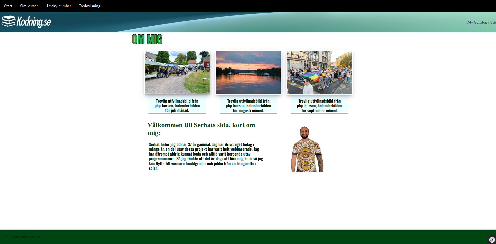

First commit Git!

======================

First image of first version of the website.

1.0.1
Here is the first upload of the new website for the MVC course.
In this stage I have created an index file, about page and a Lucky section which is showing a random imaeg with a random number.
There is also an API section of the website which shows JSON.
Here is the link, since it is not included in the menu:
http://localhost:8888/api/

1.0.2
Corrected after feedback.
http://www.student.bth.se/~sees23/dbwebb-kurser/mvc/me/report/public/api

To download the files, do this:
Through the terminal, go to the folder where you want the files.
Write:
clone git@github.com:Serhateser23/mvc-kurs.git

